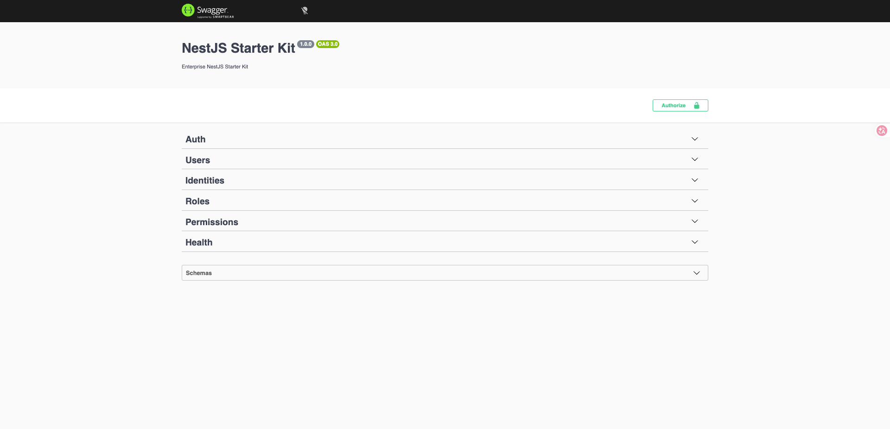

# NestJS Starter Kit

A production-ready NestJS starter kit for building secure, maintainable backend APIs. It ships with the things real teams need on day one — authentication, RBAC, a clean layered architecture, migrations, Docker, CI and tests — without the enterprise over-engineering.

[](https://github.com/GaryHu-dev/nestjs-starter-kit/actions/workflows/ci.yml)


**Who it's for:** teams (a good fit for NZ/AU SMEs) that want an enterprise-grade,
clone-and-run backend — secure and correct out of the box, without the ceremony of
a large platform. It runs on PostgreSQL alone (no Redis/queue required) and leaves
heavier concerns as documented extension points.

## Contents

- [Features](#features)
- [Tech stack](#tech-stack)
- [Requirements](#requirements)
- [Quick start](#quick-start)
- [Project structure](#project-structure)
- [Scripts](#scripts)
- [Configuration](#configuration)
- [Authentication & authorization](#authentication--authorization)
- [Quality gates](#quality-gates)
- [Testing](#testing)
- [Documentation](#documentation)
- [License](#license)

## Features

- **Authentication** — email/password with JWT access + refresh tokens. Refresh tokens are bcrypt-hashed and stored server-side; logout and password changes revoke all active sessions immediately via a per-user token version.
- **OAuth** — optional Google and GitHub sign-in (self-disabling when unconfigured), with verified-email account linking that defends against account pre-hijacking.
- **Email verification** — a full verify/resend flow backed by a pluggable `EmailSender` (logs in dev, swap for any provider in prod).
- **Dynamic RBAC** — roles and permissions are resolved from the database on every request, so grants and revocations take effect instantly; roles created at runtime can gate endpoints. Includes `user → role` management endpoints and a wildcard (`*`) permission.
- **Account protection** — per-account login lockout, stricter auth-endpoint rate limits, and proxy-aware (`TRUST_PROXY`) throttling.
- **Clean architecture** — strict `Controller → Service → Repository → Database` layering with the repository pattern (abstract interface, TypeORM implementation bound via DI).
- **Consistent API** — every response is wrapped in a typed `ApiResponse<T>` envelope with correlation metadata; a global filter normalises all errors.
- **Validation** — DTOs validated with `class-validator`; a global pipe with `whitelist` + `forbidNonWhitelisted` rejects unknown fields.
- **Database** — PostgreSQL + TypeORM with migrations, optimistic locking, and an idempotent seed for the first super-admin.
- **Security** — Helmet headers, CORS locked to one origin, rate limiting, request body limits, mandatory DB TLS in production, secrets validated at startup, no stack traces leaked to clients. See [docs/security.md](docs/security.md).
- **Observability** — structured logging (Pino) with sensitive-field redaction, per-request correlation ids, and a security **audit trail**; a Terminus health check that verifies the database.
- **DX & Ops** — Swagger docs, Docker (multi-stage, non-root, healthcheck), GitHub Actions CI (with dependency audit, CodeQL and image scanning), full unit + e2e test suites.

## Tech stack

NestJS 11 · TypeScript 5 (strict) · PostgreSQL · TypeORM · Passport/JWT · Pino · Swagger · Docker · pnpm

## Requirements

- Node.js **≥ 22**
- pnpm (the repo pins a version via `packageManager`; `corepack enable` will use it)
- Docker (for local PostgreSQL)

## Quick start

```bash
# 1. Install dependencies
pnpm install

# 2. Create your env file
cp .env.example .env
# edit .env — at minimum set strong JWT_SECRET and JWT_REFRESH_SECRET (≥32 chars)

# 3. Start PostgreSQL
docker compose up -d

# 4. Create the schema
pnpm migration:run

# 5. Seed system roles/permissions and the first super-admin
SEED_ADMIN_EMAIL=admin@example.com SEED_ADMIN_PASSWORD='ChangeMe123!' pnpm seed

# 6. Run the app
pnpm start:dev
```

The API is served at `http://localhost:3000/api/v1` and interactive Swagger docs at `http://localhost:3000/docs`:



> `scripts/setup.sh` (run via `pnpm setup`) automates steps 1–3.

## Project structure

```
src/
  common/      Cross-cutting infrastructure (filters, guards, interceptors, logger, middleware, pipes)
  config/      Strongly-typed configuration + bootstrap helpers + Joi env validation
  database/    TypeORM module, data-source, base entity, ORM entities, migrations, seeds
  modules/     Business modules (auth, users, identities, roles, permissions, health)
  shared/      Reusable TypeScript (constants, enums, types, utils, validators)
  main.ts      Application bootstrap
test/
  e2e/         End-to-end specs, grouped by module/feature
  support/     Reusable e2e helpers (app, http, auth, rbac, database, factories)
```

## Scripts

| Script | Description |
| --- | --- |
| `pnpm start:dev` | Run in watch mode |
| `pnpm build` | Compile to `dist/` |
| `pnpm start:prod` | Run the compiled app |
| `pnpm lint` | ESLint (with `--fix`) |
| `pnpm typecheck` | Full `tsc --noEmit` (incl. tests) |
| `pnpm test` / `pnpm test:cov` | Unit tests / with coverage |
| `pnpm test:e2e` | End-to-end tests (needs PostgreSQL) |
| `pnpm migration:generate --name=X` | Generate a migration from entity changes |
| `pnpm migration:run` / `pnpm migration:run:prod` | Apply migrations (dev / compiled) |
| `pnpm migration:revert` / `pnpm migration:show` | Revert last / show status |
| `pnpm seed` / `pnpm seed:prod` | Seed roles, permissions and the first super-admin |

> Generating a migration from a clean baseline has a `ts-node` gotcha with this
> tsconfig — see [Troubleshooting → Migrations](docs/troubleshooting.md#migrations).

## Configuration

All configuration comes from environment variables, validated at startup with Joi (the app fails fast on missing/invalid values). See [`.env.example`](.env.example) for the full list. Key variables:

| Variable | Notes |
| --- | --- |
| `JWT_SECRET`, `JWT_REFRESH_SECRET` | Required, ≥ 32 chars. Use distinct, high-entropy values. |
| `DATABASE_*` | Connection settings. Set `DATABASE_SSL=true` in production. |
| `DATABASE_SYNCHRONIZE` | Dev convenience only — force-disabled when `NODE_ENV=production`. |
| `FRONTEND_URL` | The single CORS origin allowed to call the API with credentials. |
| `SWAGGER_ENABLED` | Serve `/docs`. Always disabled in production. |
| `GOOGLE_*` / `GITHUB_*` | Optional OAuth. Setting a client id requires its secret + callback URL. |

## Authentication & authorization

- Every route requires a valid Bearer JWT unless marked `@Public()`.
- Access tokens are opaque to clients and carry only `sub`, `email`, `provider` and a token-version (`tv`) claim — **not** roles/permissions. Authorization is resolved from the database on every request, so grants and revocations take effect on the user's **next request** (no re-login, no waiting for token expiry). Logout / password change / OAuth takeover revoke outstanding tokens via the token version.
- `@Roles(...)` and `@Permissions(...)` decorators enforce RBAC (string codes, so runtime-created roles work); the `*` permission grants everything.
- The first privileged account is created by the seed — the role-management endpoints are themselves RBAC-guarded, so it cannot be bootstrapped over the API.
- Email verification is available but **informational** — an unverified user is not blocked from the API by default. See [docs/security.md](docs/security.md) to make it a gate.

## Quality gates

Every push and pull request runs six gates in CI — all must pass to merge:

| Gate | Command | Enforces |
| --- | --- | --- |
| Types | `pnpm typecheck` | Full `tsc --noEmit`, including tests |
| Lint | `pnpm lint` | ESLint + Prettier |
| Build | `pnpm build` | Clean production compile |
| Unit + coverage | `pnpm test:cov` | Coverage thresholds **90 / 85 / 90 / 90** (statements / branches / functions / lines) |
| E2E | `pnpm test:e2e` | Full HTTP suite booted against PostgreSQL |
| Migrations | `pnpm migration:run:prod` | Compiled migrations apply cleanly to a fresh schema |

Plus supply-chain checks: a production `pnpm audit`, CodeQL SAST, and a Trivy scan
of the built Docker image.

## Testing

```bash
pnpm test        # unit
pnpm test:cov    # unit + coverage (thresholds: 90/85/90/90)
pnpm test:e2e    # end-to-end (boots the app against PostgreSQL)
```

## Documentation

- [Architecture](docs/architecture.md)
- [Architecture Decision Records](docs/adr/README.md)
- [API reference](docs/api.md)
- [Database & migrations](docs/database.md)
- [Security](docs/security.md)
- [Deployment](docs/deployment.md)
- [Troubleshooting](docs/troubleshooting.md)
- [Coding style](docs/coding-style.md)
- [Contributing](docs/contributing.md)
- [Releasing](docs/release.md)
- [Changelog](CHANGELOG.md)

## License

[MIT](LICENSE)
